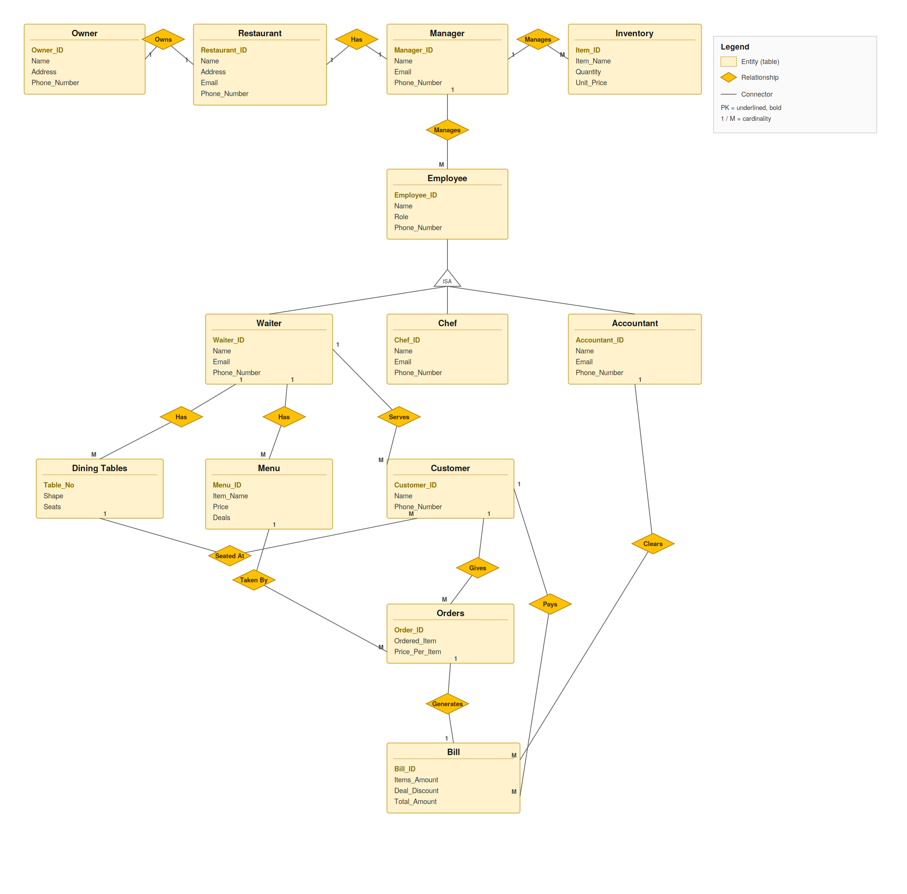

# 🍽️ Restaurant Management System (DBMS Project)


A relational database project that models the day-to-day operations of a restaurant — from ownership and staff management to customer orders and billing. Built as a Database Management Systems course project.

## 📌 Overview

This system manages the complete workflow of a restaurant:

- **Owner** owns a **Restaurant**, which is run by a **Manager**.
- The **Manager** oversees **Inventory** and supervises **Employees**.
- **Employees** are specialized into **Waiters**, **Chefs**, and **Accountants**.
- **Waiters** are assigned **Dining Tables** and manage **Menu** items.
- **Customers** place **Orders** through waiters, and every order generates a **Bill**, which an accountant clears.

## 💡 Why This Project?

Restaurants juggle a lot at once — owners, managers, staff, live inventory, table assignments, and billing — and many small-to-medium setups still track this across registers, notebooks, or disconnected spreadsheets. Modeling it as a single relational database means:

- All restaurant data lives in one consistent place instead of being scattered
- Orders, bills, and inventory stay in sync instead of relying on manual cross-checking
- Staff roles and reporting lines are clearly defined
- The data becomes queryable — who's serving which table, which menu items have an active deal, which customers generated the most revenue — instead of sitting unused

## 🗂️ ER Diagram



> Entity-relationship diagram showing all 13 tables, their attributes, primary keys, and relationships — including the `Employee → Waiter / Chef / Accountant` specialization (ISA) hierarchy. An editable `.svg` version is included in the repo for future updates.

## 🛠️ Tech Stack

- **Database:** MySQL
- **Local Server:** XAMPP (Apache + MySQL)
- **Admin Tool:** phpMyAdmin
- **Tested on:** SQL Fiddle (MySQL dialect)

## 📋 Entities (Tables)

| Table | Description |
|---|---|
| `Owner` | Restaurant owner details |
| `Restaurant` | Restaurant info, linked to its owner |
| `Manager` | Manager assigned to a restaurant |
| `Inventory` | Stock items managed by a manager |
| `Employee` | Base staff record (role: Waiter/Chef/Accountant) |
| `Waiter` | Waiter-specific details (ISA Employee) |
| `Chef` | Chef-specific details (ISA Employee) |
| `Accountant` | Accountant-specific details (ISA Employee) |
| `Dining_Tables` | Tables assigned to waiters |
| `Menu` | Menu items and deals served by waiters |
| `Customer` | Customer records |
| `Orders` | Orders placed by customers |
| `Bill` | Bill generated per order, cleared by an accountant |

## 🔗 Key Design Decisions

- **Specialization (ISA):** `Employee` is the supertype; `Waiter`, `Chef`, and `Accountant` are subtypes that each carry their own contact details while sharing a common `Employee_ID`, avoiding duplicate base attributes across the three.
- **Ownership chain:** `Owner → Restaurant → Manager → Employee` mirrors a real restaurant's reporting structure, so every staff member and inventory item traces back to a specific restaurant and manager.
- **Billing trail:** Every `Order` generates exactly one `Bill`, and every `Bill` is cleared by an `Accountant` — keeping a clean, auditable trail from order to payment.

## 🚀 How to Run

1. Install [XAMPP](https://www.apachefriends.org/) and start **Apache** + **MySQL** from the control panel.
2. Open `http://localhost/phpmyadmin/` in your browser.
3. Create a new database, e.g. `RMS`.
4. Open the **Import** (or **SQL**) tab and run [`schema.sql`](schema.sql) — this creates all tables and inserts sample data.
5. Run any query from [`queries.sql`](queries.sql) to test the database.

> **Quick test without installing anything:** paste `schema.sql` into [SQL Fiddle](http://sqlfiddle.com/) (Build Schema panel, MySQL dialect), then run queries from `queries.sql` in the Query panel.

## 🔍 Sample Queries Included

- List customers along with the items they ordered
- Orders handled by a specific waiter
- Bill details for a specific customer
- Menu items that include a deal
- `INNER JOIN`, `LEFT JOIN`, `RIGHT JOIN` examples
- A nested subquery (customers with above-average order amounts)
- A correlated subquery using `EXISTS` (4+ table join)

## 🔮 Future Enhancements

- Online ordering and table reservation support
- Customer loyalty points and rewards tracking
- A simple analytics view — best-selling menu items, peak hours, revenue trends
- Multi-branch support, allowing one `Owner` to manage several `Restaurant` locations

## 📁 Project Structure

```
restaurant-management-system/
├── README.md
├── schema.sql
├── queries.sql
├── Restaurant_ERD_Corrected.png   ← ER diagram (used in this README)
└── Restaurant_ERD_Corrected.svg   ← editable vector version
```

## 👤 Author

Built by **Shanum Shahzad** — a Database Management Systems project covering schema design, ER modeling, and SQL querying (joins, nested subqueries, correlated subqueries).

## 📄 License

This project is open-sourced for educational purposes.
